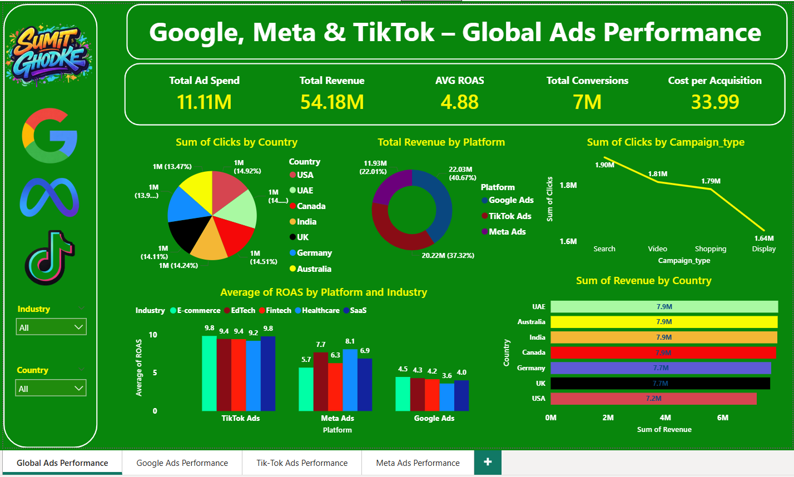
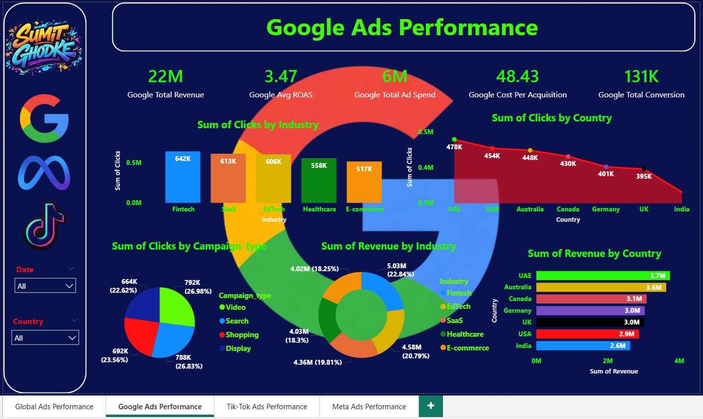
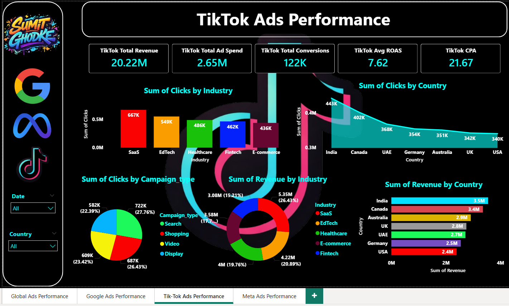
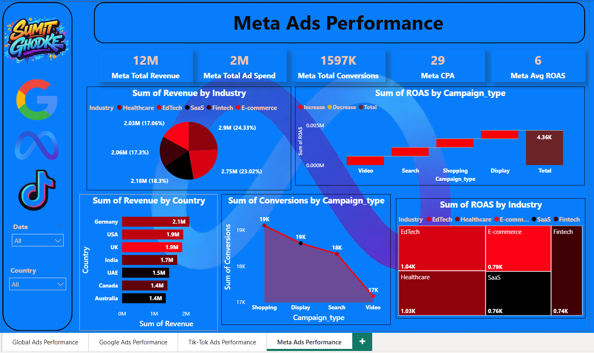

# 📊 Google, Meta & TikTok Global Ads Performance Dashboard

This project presents an interactive Power BI dashboard analyzing global advertising performance across Google Ads, Meta Ads, and TikTok Ads platforms.

The dashboard provides insights into ad spend, revenue, ROAS, conversions, industries, countries, and campaign performance for better marketing decision-making.

---

# 🚀 Project Objective
To analyze and compare global ads performance across platforms and identify top-performing countries, industries, and campaign types using Power BI.

---

# 🛠 Tools & Technologies Used
- Power BI
- Data Visualization
- DAX (Data Analysis Expressions)
- Excel
- Business Intelligence

---

# 📊 Key KPIs
- Total Ad Spend
- Total Revenue
- Average ROAS
- Cost Per Acquisition (CPA)
- Total Conversions
- Click Performance

---

# 📷 Dashboard Preview

## 🌍 Global Ads Performance Dashboard

## 🔵 Google Ads Performance Dashboard

## ⚫ TikTok Ads Performance Dashboard

## 🔷 Meta Ads Performance Dashboard

---

# 📈 Key Insights
- Google Ads generates highest revenue
- TikTok Ads provides highest ROAS
- Meta Ads shows strong conversions
- Video campaigns give high engagement
- UAE, Australia & India top performing countries
- SaaS & E-commerce strong industries

---

# 💼 Skills Demonstrated
- Data Cleaning & Transformation
- Data Visualization
- Dashboard Design
- Business Insights
- Marketing Analytics

---

# 👨‍💻 Author
Sumit Ghodke  
Aspiring Data Analyst | Power BI | SQL | Python | Tableau  

[(LinkedIn link ](https://www.linkedin.com/in/sumit-ghodke-a45a82205/))

---

⭐ If you like this project, give it a star on GitHub.
